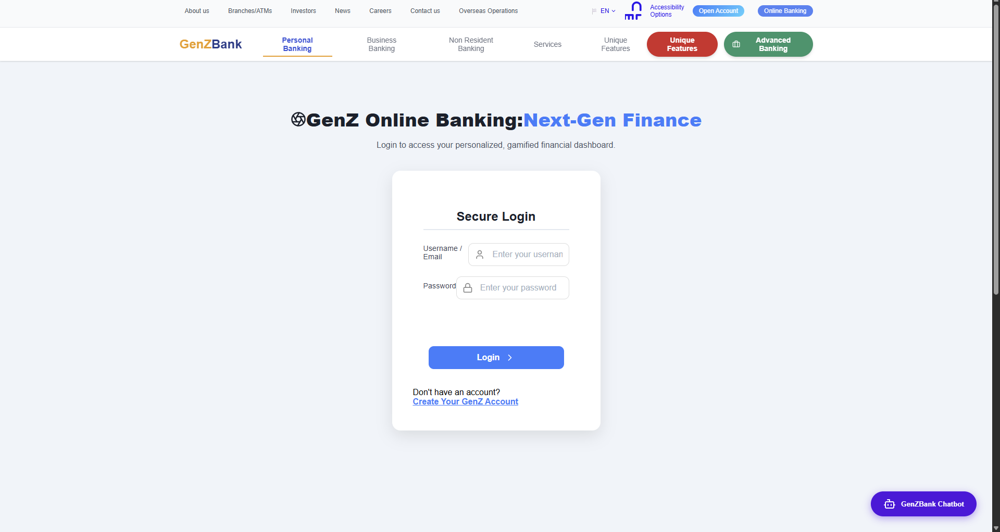
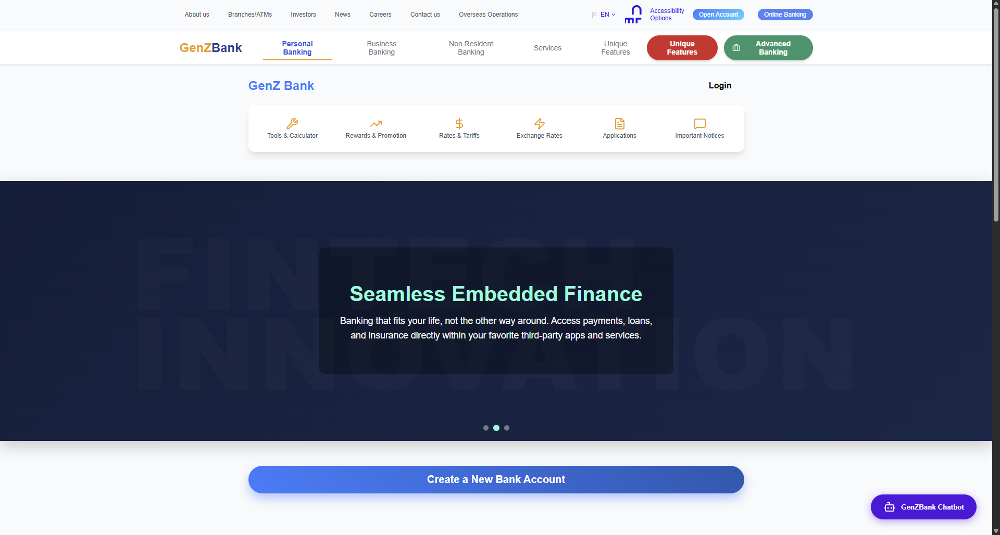
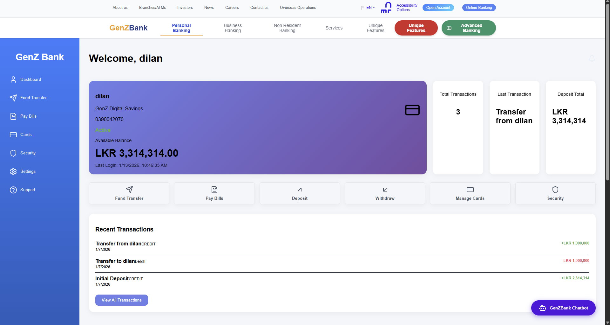
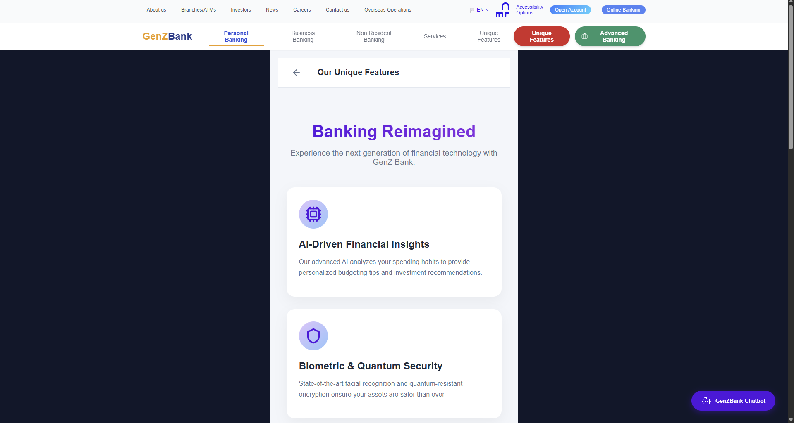
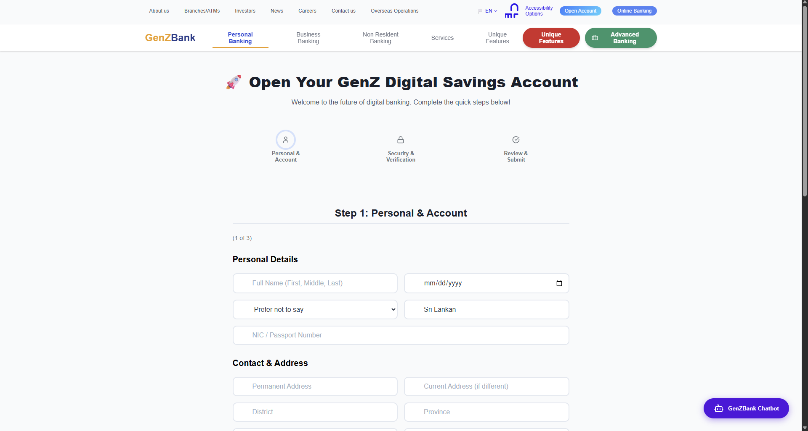
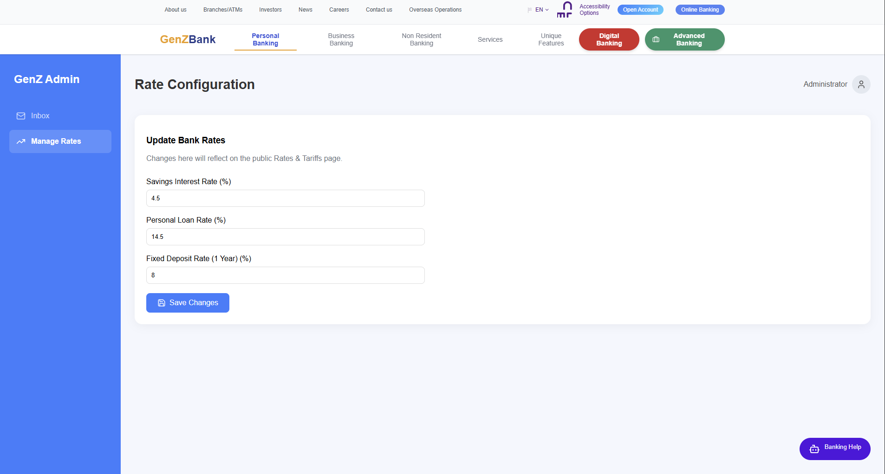

# 🏦 Banking Web Application

A full-stack banking web application designed to handle core banking operations such as user authentication, account management, transactions, and balance tracking.  
The system is built using **Spring Boot** for the backend, **MongoDB** for data storage, and **React** for the frontend.


## ✨ Features

- Account Creation 
- Authentication
- Account Management
- Fund Transfers
- Transaction History
- Real-time Balance Updates
- Responsive User Interface
- RESTful API Architecture


## 🛠️ Tech Stack

### Backend
- **Java**
- **Spring Boot**
- **Spring Security**
- **Spring Data MongoDB**
- **REST APIs**

### Frontend
- **React**
- **JavaScript**
- **HTML5**
- **CSS**

### Database
- **MongoDB**


## 📂 Project Structure

```text
Banking-application/
│
├── Banking_Application-main/
│   ├── backend/
│   │   ├── .idea
│   │   ├── .mvn
│   │   ├── src
│   │   ├── target
│   │   ├── .gitattributes
│   │   ├── .gitignore
│   │   ├── mvnw
│   │   ├── mvnw.cmd
│   │   └── pom.xml
│   │
│   ├── chatbot/
│   │   └── chatbot/
│   │       ├── .idea
│   │       ├── .mvn
│   │       ├── src
│   │       ├── target
│   │       ├── .gitattributes
│   │       ├── .gitignore
│   │       ├── HELP.md
│   │       ├── mvnw
│   │       ├── mvnw.cmd
│   │       └── pom.xml
│   │
│   ├── node_modules/..
│   │
│   ├── public/
│   │
│   └── src/...
│
├── node_modules/
│   ├── @google
│   ├── lucide-react
│   ├── react
│   └── .package-lock.json
│
├── screenshot/
│
├── src/
│
├── .gitignore
├── estlint.config.js
├── index.html
├── package.json
├── package-lock.json
├── README.md
└── vite.config.js
```

## ⚙️ Installation & Setup

### Prerequisites
- Java 17+
- Node.js & npm
- MongoDB
- Git


### Backend Setup (Spring boot)

1. Clone the repository:
   ```bash
   https://github.com/kdsmaduranga/Banking_Application.git

2. Open the folder using an IDE such as IntelliJ

3. Navigate to backend folder:
   ```bash
   cd backend
   
4. Configure MongoDB connection in **application.properties**

5. Run the Application


### Frontend Setup (React)

1. Open the folder using **Visual Studio Code**

2. Navigate to frontend folder:
   ```bash
   cd src
   
3. Install dependancies:
   ```bash
   npm install

4. Start the react app:
   ```bash
   npm run dev
   
5. Frontend will start on:
   ```bash
   http://localhost:5173

   
## 🔐 API Security

- Uses Spring Security
- Passwords are encrypted


## 🤝 Contributing

- [Kahawita Maduranga](https://github.com/kdsmaduranga) - Backend and Database Configuration
- [Dilan Amantha](https://github.com/lynx7843) - Frontend
- [Sasrika Kaumadi](https://github.com/wsklwithana) 
- [Kavindu Fernando](https://github.com/pktfernando) 
- [Sayuni](https://github.com/SayuniDHS)
- [Esandi](https://github.com/EsandiWijesinghe)
- [Upeka](https://github.com/upeka200163)
- [Kumudhitha](https://github.com/KumudithaRupz)
- [Buddhima Deshan](https://github.com/Ukdbdeshan)
- [Sachintha](https://github.com/Sachinthap)


## 📷 Screenshots

| Login | Dashboard |
|-------|-----------|
|  |  |

| Customer | Unique Features |
|-------------|---------|
|  |  |

| Account Creation | Manager Dashboard |
|-------|-----------|
|  |  |


## 📄 License
This project is licensed under the Apache-2.0 License.
